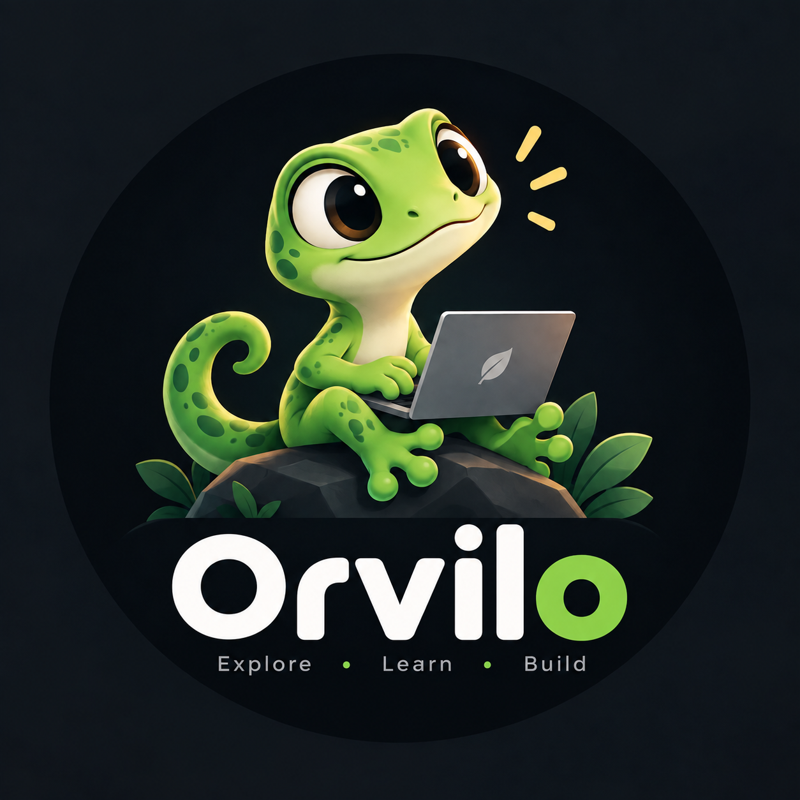
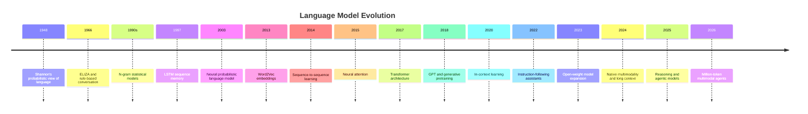
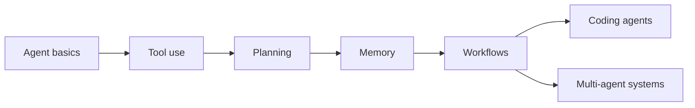

# Orvilo

<div align="center">
  
  <h3>Explore. Learn. Build. 🦎</h3>
  <p>A visual, learning-first guide to language models—from statistical foundations to modern multimodal and reasoning systems.</p>
  <p><a href="#start-learning">Start learning</a> · <a href="#model-family-guides">Browse model families</a> · <a href=".github/CONTRIBUTING.md">Contribute</a></p>
</div>

---

## What Is Orvilo?

Orvilo is an open-source educational project that explains how language models evolved, how their core mechanisms work, and how major model families differ.

The documentation is designed around three principles:

- **Understand the idea:** explanations begin with the problem a technique solves.
- **See the progression:** diagrams connect each model to the ideas that came before it.
- **Compare responsibly:** tables separate architecture, context, modality, reasoning, and deployment tradeoffs instead of treating one benchmark as the whole story.

No prior machine-learning expertise is required. Start with the foundations and move forward at your own pace.

## Start Learning

```mermaid
flowchart LR
    S["Statistical<br/>Language Models"] --> N["Neural<br/>Language Models"]
    N --> E["Embeddings"] --> R["Sequence<br/>Models"] --> A["Attention"] --> T["Transformers"] --> L["Modern LLM<br/>Families"]

    classDef foundation fill:#dbeafe,stroke:#2563eb,color:#172554
    classDef neural fill:#dcfce7,stroke:#16a34a,color:#052e16
    classDef modern fill:#f3e8ff,stroke:#9333ea,color:#3b0764
    class S foundation
    class N,E,R,A neural
    class T,L modern

    click S "models/shannon-statistical-language-modeling.md" "Begin with statistical language modeling"
    click N "models/neural-probabilistic-language-model.md" "Learn neural language modeling"
    click E "models/word2vec.md" "Learn word embeddings"
    click R "models/lstm.md" "Learn sequence models"
    click A "models/attention-mechanism.md" "Learn attention"
    click T "models/transformer.md" "Learn Transformers"
```



### Foundations

| Era | Topic | What you will learn |
|---:|---|---|
| 1948 | [Shannon and statistical language modeling](models/shannon-statistical-language-modeling.md) | Predicting language with probability |
| 1966 | [ELIZA](models/eliza.md) | Rule-based conversation before neural networks |
| 1980s–90s | [N-gram language models](models/n-gram-language-model.md) | Predicting from local token counts |
| 1997 | [LSTM](models/lstm.md) | Memory and long-term dependencies in sequences |
| 2003 | [Neural probabilistic language models](models/neural-probabilistic-language-model.md) | Learning distributed word representations |
| 2013 | [Word2Vec](models/word2vec.md) | Representing meaning with vectors |
| 2014 | [Sequence to Sequence](models/seq2seq.md) | Transforming one sequence into another |
| 2014–15 | [Attention](models/attention-mechanism.md) | Selecting relevant information dynamically |
| 2017 | [Transformer](models/transformer.md) | Parallel sequence modeling with self-attention |

## From Foundations to Modern Models



## Learn About AI Agents

Modern models become substantially more useful when they can choose tools, observe results, and adapt their actions.



| Guide | What you will learn |
|---|---|
| [What Is an AI Agent?](agents/what-is-an-agent.md) | Agent loops, components, autonomy, and safety |
| [Tool Use](agents/tool-use.md) | Tool contracts, validation, permissions, and errors |
| [Planning](agents/planning.md) | Plans, dependencies, replanning, and completion evidence |
| [Memory](agents/memory.md) | Working state, long-term memory, retrieval, and privacy |
| [Agentic Workflows](agents/workflows.md) | Chaining, routing, parallelization, and reliability |
| [Coding Agents](agents/coding-agents.md) | Repository work, editing, testing, and secure execution |
| [Multi-Agent Systems](agents/multi-agent.md) | Delegation, coordination, shared state, and evaluation |

## Model Family Guides

Each completed guide contains a recommended reading order, clickable evolution diagram, technical comparison table, and capability matrix.

| Model family | Guide | Main themes |
|---|---|---|
| OpenAI GPT | [Explore GPT →](models/gpt/README.md) | Pretraining, RLHF, multimodality, reasoning, and agents |
| DeepSeek | [Explore DeepSeek →](models/deepseek/README.md) | MoE, MLA, reinforcement learning, and sparse attention |
| Google Gemini | [Explore Gemini →](models/gemini/README.md) | Native multimodality, long context, thinking, and tools |
| Meta Llama | [Explore Llama →](models/llama/README.md) | Open weights, efficient deployment, vision, and MoE |
| Mistral AI | [Explore Mistral →](models/mistral/README.md) | Dense models, sparse experts, and local inference |
| Alibaba Qwen | [Explore Qwen →](models/qwen/README.md) | Multilingual models, code, mathematics, and hybrid thinking |
| Google Gemma | [Explore Gemma →](models/gemma/README.md) | Efficient open weights, code, vision, and edge deployment |
| Microsoft Phi | [Explore Phi →](models/phi/README.md) | Small language models, synthetic data, reasoning, and multimodality |
| xAI Grok | [Explore Grok →](models/grok/README.md) | Real-time information, reasoning, search, and agents |
| Moonshot Kimi | [Explore Kimi →](models/kimi/README.md) | Sparse experts, multimodal reasoning, coding, and agents |
| Z.ai GLM | [Explore GLM →](models/glm/README.md) | Bilingual foundations, long context, MoE, and agentic coding |
| Cohere Command | [Explore Command →](models/command/README.md) | Enterprise RAG, citations, multilingual work, and tools |
| IBM Granite | [Explore Granite →](models/granite/README.md) | Efficient enterprise models, governance, RAG, and agents |
| Ai2 OLMo | [Explore OLMo →](models/olmo/README.md) | Fully open data, training, checkpoints, and evaluation |
| TII Falcon | [Explore Falcon →](models/falcon/README.md) | RefinedWeb, open weights, and efficient attention |
| OpenAI GPT-OSS | [Explore GPT-OSS →](models/gpt-oss/README.md) | Open-weight reasoning, sparse experts, tools, and local deployment |

## How to Compare Models

Model names alone rarely tell the full story. Consider several dimensions:

| Dimension | Question to ask |
|---|---|
| Architecture | Is it dense, Mixture-of-Experts, multimodal, or specialized? |
| Active parameters | How much of the model is used for each token? |
| Context window | How much input can it accept, and how reliably can it use it? |
| Modalities | Does it accept or generate text, images, audio, or video? |
| Post-training | Was it instruction-tuned, preference-aligned, or trained with reinforcement learning? |
| Tool use | Can it call functions, search, execute code, or operate software? |
| Deployment | Is it API-only, open-weight, local, edge-ready, or distributed? |
| Limitations | Where can it hallucinate, miss context, or take unsafe actions? |

> A larger parameter count or context window does not automatically make a model better. Training quality, active computation, data, post-training, tools, latency, and the task itself all matter.

## Repository Structure

```text
Orvilo/
├── README.md                  Project overview and learning path
├── assets/                    Documentation images
├── models/
│   ├── *.md                   Foundational concepts
│   ├── deepseek/              DeepSeek family guide
│   ├── gemini/                Gemini family guide
│   ├── gpt/                   GPT family guide
│   ├── llama/                 Llama family guide
│   ├── mistral/               Mistral family guide
│   ├── qwen/                  Qwen family guide
│   ├── gemma/                 Gemma family guide
│   ├── phi/                   Phi family guide
│   ├── grok/                  Grok family guide
│   ├── kimi/                  Kimi family guide
│   ├── glm/                   GLM family guide
│   ├── command/               Command family guide
│   ├── granite/               Granite family guide
│   ├── olmo/                  OLMo family guide
│   ├── falcon/                Falcon family guide
│   └── gpt-oss/               GPT-OSS family guide
└── .github/
    ├── CONTRIBUTING.md        Contribution guidelines
    ├── ISSUE_TEMPLATE/        Issue forms
    └── workflows/             Quality checks
```

## Project Status

Orvilo is actively growing. Completed family guides are listed above; additional model families and translations are being prepared. Technical details are checked against official model cards, research papers, and vendor documentation whenever possible.

Found an inaccurate release date, capability, context limit, or architectural claim? [Open a bug report](.github/ISSUE_TEMPLATE/bug-report.md) and include a primary source.

## Contributing

Contributions are welcome—from correcting one sentence to documenting an entire model generation.

1. Read the [contribution guide](.github/CONTRIBUTING.md).
2. Use lowercase kebab-case for documentation filenames.
3. Write technical claims in your own words and cite primary sources.
4. Check relative links, tables, and Mermaid diagrams.
5. Run `git diff --check`.

---

<div align="center">
  <strong>Orvilo — Explore. Learn. Build. 🦎</strong>
</div>
