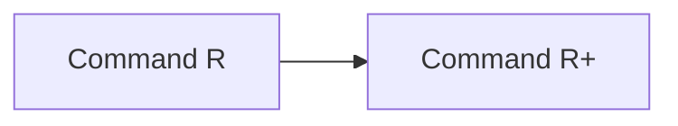

# Cohere Command Model Guide

Command R is Cohere's enterprise-focused generation family, optimized for retrieval-augmented generation, citations, multilingual work, and tool use.

## Evolution

## Comparison

| Model | Parameters | Context | Modality | Defining focus |
|---|---:|---:|---|---|
| [Command R](command-r.md) | 35B | 128K | Text | Efficient RAG and single-step tools |
| [Command R+](command-r-plus.md) | 104B | 128K | Text | Complex RAG and multi-step agents |

## Capability Matrix

| Model | Chat | Code | Reasoning | Tools/RAG | Multimodal | Local deployment |
|---|:---:|:---:|:---:|:---:|:---:|:---:|
| Command R | ● | ◐ | ◐ | ● | — | ◐ |
| Command R+ | ● | ● | ● | ● | — | ◐ |

**Legend:** ● strong or defining · ◐ partial or variant-dependent · — not defining

## How to Choose

- Start with the smallest model that meets your quality and context requirements.
- Check the exact checkpoint: context, modality, license, and instruction format can differ within one generation.
- Measure quality, latency, memory, and safety on your own workload rather than relying on one benchmark.
- Ground factual applications with trusted data and validate generated code before execution.

## Official Sources

- [Official Command R documentation](https://docs.cohere.com/docs/command-r)
- [Official Command R+ documentation](https://docs.cohere.com/docs/command-r-plus)
