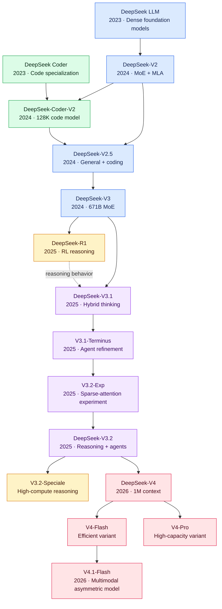

# DeepSeek Model Guide

This directory explains the development of DeepSeek's main language and code models. Read the documents roughly in this order:

1. [DeepSeek LLM](deepseek-llm.md) — first general English-Chinese models
2. [DeepSeek Coder](deepseek-coder.md) — first code-focused family
3. [DeepSeek-V2](deepseek-v2.md) — DeepSeekMoE and Multi-head Latent Attention
4. [DeepSeek-Coder-V2](deepseek-coder-v2.md) — V2 architecture specialized for code
5. [DeepSeek-V2.5](deepseek-v2.5.md) — combined chat and coding model
6. [DeepSeek-V3](deepseek-v3.md) — larger, efficiently trained MoE model
7. [DeepSeek-R1](deepseek-r1.md) — reinforcement-learning-based reasoning
8. [DeepSeek-V3.1](deepseek-v3.1.md) — hybrid thinking and tool use
9. [DeepSeek-V3.1-Terminus](deepseek-v3.1-terminus.md) — refined V3.1 release
10. [DeepSeek-V3.2-Exp](deepseek-v3.2-exp.md) — experimental sparse attention
11. [DeepSeek-V3.2](deepseek-v3.2.md) — reasoning and agentic model
12. [DeepSeek-V3.2-Speciale](deepseek-v3.2-speciale.md) — high-compute reasoning variant
13. [DeepSeek-V4](deepseek-v4.md) — million-token V4 family
14. [DeepSeek-V4-Flash](deepseek-v4-flash.md) — efficient V4 variant
15. [DeepSeek-V4-Pro](deepseek-v4-pro.md) — high-capacity V4 variant
16. [DeepSeek-V4.1-Flash](deepseek-v4.1-flash.md) — multimodal asymmetric architecture

Model names with dates or labels such as `Exp`, `Terminus`, and `Speciale` are specific revisions or variants; they are not entirely separate model generations.

## DeepSeek Model Evolution

The diagram is interactive: select a model to open its detailed English guide. Colors distinguish foundation models, code models, reasoning models, agent-oriented releases, and the V4 family.

## DeepSeek Model Comparison

| Model | Total parameters | Active parameters | Context | Primary focus | Defining feature |
|---|---:|---:|---:|---|---|
| [DeepSeek LLM](deepseek-llm.md) | 7B / 67B | Dense | 4K | General language | Dense Transformer |
| [DeepSeek Coder](deepseek-coder.md) | 1B–33B | Dense | 16K | Code | Project-level code and FIM |
| [DeepSeek-V2](deepseek-v2.md) | 236B | 21B | 128K | General language | DeepSeekMoE and MLA |
| [DeepSeek-Coder-V2](deepseek-coder-v2.md) | 16B / 236B | 2.4B / 21B | 128K | Code | MoE, MLA, and 338 languages |
| [DeepSeek-V2.5](deepseek-v2.5.md) | 236B | 21B | 128K | General + code | Unified Chat and Coder model |
| [DeepSeek-V3](deepseek-v3.md) | 671B | 37B | 128K | General language | FP8 and multi-token prediction |
| [DeepSeek-R1](deepseek-r1.md) | 671B | 37B | 128K | Deep reasoning | Reinforcement learning |
| [DeepSeek-V3.1](deepseek-v3.1.md) | 671B | 37B | 128K | Hybrid reasoning | Thinking modes and tools |
| [V3.1-Terminus](deepseek-v3.1-terminus.md) | 671B | 37B | 128K | Agents | Refined agent behavior |
| [V3.2-Exp](deepseek-v3.2-exp.md) | 671B | 37B | 128K | Long-context efficiency | Sparse-attention experiment |
| [DeepSeek-V3.2](deepseek-v3.2.md) | 671B | 37B | 128K | Reasoning + agents | DSA and reasoning with tools |
| [V3.2-Speciale](deepseek-v3.2-speciale.md) | 671B | 37B | 128K | Maximum reasoning | High compute; no tool calling |
| [DeepSeek-V4](deepseek-v4.md) | 284B–1.6T | 13B–49B | 1M | Long-running agents | Long-context MoE family |
| [V4-Flash](deepseek-v4-flash.md) | 284B | 13B | 1M | Efficient agents | Smaller V4 variant |
| [V4-Pro](deepseek-v4-pro.md) | 1.6T | 49B | 1M | High-capacity agents | Largest V4 variant |
| [V4.1-Flash](deepseek-v4.1-flash.md) | 552B | 8B input / 16B output | — | Multimodal agents | Asymmetric encoder-decoder |

### Capability Matrix

| Model family | Chat | Code | Reasoning | Tools | Long context | Vision |
|---|:---:|:---:|:---:|:---:|:---:|:---:|
| DeepSeek LLM | ● | ◐ | — | — | — | — |
| DeepSeek Coder | ◐ | ● | — | — | ◐ | — |
| DeepSeek-V2 | ● | ● | ◐ | ◐ | ● | — |
| DeepSeek-Coder-V2 | ● | ● | ◐ | ◐ | ● | — |
| DeepSeek-V2.5 | ● | ● | ◐ | ● | ● | — |
| DeepSeek-V3 | ● | ● | ◐ | ● | ● | — |
| DeepSeek-R1 | ◐ | ● | ● | ◐ | ● | — |
| DeepSeek-V3.1 | ● | ● | ● | ● | ● | — |
| DeepSeek-V3.2 | ● | ● | ● | ● | ● | — |
| V3.2-Speciale | ◐ | ● | ● | — | ● | — |
| DeepSeek-V4-Flash | ● | ● | ● | ● | ● | — |
| DeepSeek-V4-Pro | ● | ● | ● | ● | ● | — |
| DeepSeek-V4.1-Flash | ● | ● | ● | ● | ● | ● |

**Legend:** ● primary or strong capability · ◐ secondary capability · — not a defining capability

> Parameter count alone does not measure quality. MoE models activate only part of their total parameters for each token, and a larger context window does not guarantee perfect recall.
