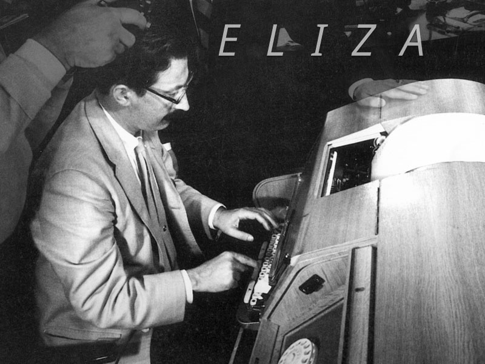

# Eliza 

ELIZA is a neural language conversation program described by Joseph Weizenbaum in January 1966.

ELIZA simulated a conversation between a human and a Rogerian-style psychotherapist. The original version was developed at MIT for the Project MAC time-sharing system, running on an IBM 7094 and implemented using MAD-SLIP.


<p align="center">


<p align="center"><strong>
Joseph Weizenbaum 1966</strong></p>
</p>

**Interaction at the terminal while Joseph Weizenbaum was developing ELIZA.**

```
> I am unhappy.

ELIZA: DO YOU THINK COMING HERE
       WILL HELP YOU NOT TO BE UNHAPPY?

> I need some help.

ELIZA: WHAT WOULD IT MEAN TO YOU
       IF YOU GOT SOME HELP?

> My mother worries me.

ELIZA: TELL ME MORE ABOUT YOUR FAMILY.
```
