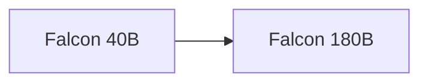

# TII Falcon Model Guide

Falcon is an open-weight language-model family from Abu Dhabi's Technology Innovation Institute. Its early releases focused on efficient decoder-only models trained on the RefinedWeb corpus.

## Evolution

## Comparison

| Model | Parameters | Context | Modality | Defining focus |
|---|---:|---:|---|---|
| [Falcon 40B](falcon-40b.md) | 40B | 2K | Text | Multi-query attention and RefinedWeb |
| [Falcon 180B](falcon-180b.md) | 180B | 2K | Text | Large-scale open pretrained model |

## Capability Matrix

| Model | Chat | Code | Reasoning | Tools/RAG | Multimodal | Local deployment |
|---|:---:|:---:|:---:|:---:|:---:|:---:|
| Falcon 40B | ● | ◐ | ◐ | ◐ | — | ● |
| Falcon 180B | ● | ● | ● | ◐ | — | ● |

**Legend:** ● strong or defining · ◐ partial or variant-dependent · — not defining

## How to Choose

- Start with the smallest model that meets your quality and context requirements.
- Check the exact checkpoint: context, modality, license, and instruction format can differ within one generation.
- Measure quality, latency, memory, and safety on your own workload rather than relying on one benchmark.
- Ground factual applications with trusted data and validate generated code before execution.

## Official Sources

- [Official Falcon 40B documentation](https://huggingface.co/tiiuae/falcon-40b)
- [Official Falcon 180B documentation](https://huggingface.co/tiiuae/falcon-180B)
