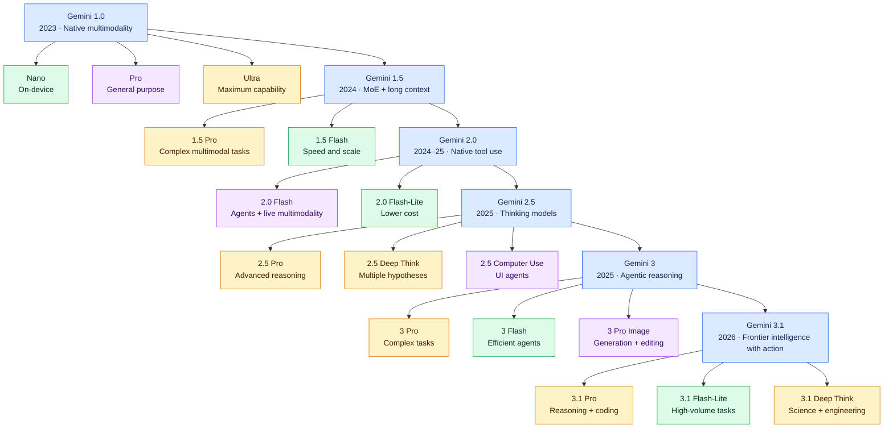

# Gemini Model Guide

This directory explains the major generations of Google's Gemini models. Google does not publish parameter counts for these proprietary models, so the comparison focuses on documented capabilities and context limits.

1. [Gemini 1.0](gemini-1.0.md) — native multimodality and Nano/Pro/Ultra tiers
2. [Gemini 1.5](gemini-1.5.md) — Mixture of Experts and million-token context
3. [Gemini 2.0](gemini-2.0.md) — native tool use and live interaction
4. [Gemini 2.5](gemini-2.5.md) — thinking models and computer use
5. [Gemini 3](gemini-3.md) — multimodal reasoning and agentic workflows
6. [Gemini 3.1](gemini-3.1.md) — stronger reasoning, coding, and agents

## Gemini Model Evolution

Select a blue generation node to open its detailed English guide.

## Gemini Generation Comparison

| Generation | Released | Main tiers or variants | Documented context | Defining change |
|---|---:|---|---:|---|
| [Gemini 1.0](gemini-1.0.md) | 2023 | Nano, Pro, Ultra | 32K | Native multimodal training |
| [Gemini 1.5](gemini-1.5.md) | 2024 | Pro, Flash, Flash-8B | Up to 1M | MoE and very long context |
| [Gemini 2.0](gemini-2.0.md) | 2024–25 | Flash, Flash-Lite, Pro Experimental | Up to 1M | Native tools and Live API |
| [Gemini 2.5](gemini-2.5.md) | 2025 | Pro, Flash, Flash-Lite, Deep Think, Computer Use | Up to 1M | Thinking and UI agents |
| [Gemini 3](gemini-3.md) | 2025 | Pro, Flash, Pro Image | Up to 1M | Stronger agentic multimodal reasoning |
| [Gemini 3.1](gemini-3.1.md) | 2026 | Pro, Flash-Lite, Deep Think, Image, Audio | Up to 1M | Advanced coding and long-horizon agents |

## Capability Matrix

| Generation | Text | Image input | Audio/video | Long context | Thinking | Tool use | Image output |
|---|:---:|:---:|:---:|:---:|:---:|:---:|:---:|
| Gemini 1.0 | ● | ● | ● | ◐ | ◐ | ◐ | — |
| Gemini 1.5 | ● | ● | ● | ● | ◐ | ● | — |
| Gemini 2.0 | ● | ● | ● | ● | ◐ | ● | ◐ |
| Gemini 2.5 | ● | ● | ● | ● | ● | ● | ● |
| Gemini 3 | ● | ● | ● | ● | ● | ● | ● |
| Gemini 3.1 | ● | ● | ● | ● | ● | ● | ● |

**Legend:** ● primary or strong capability · ◐ partial, variant-dependent, or emerging capability · — not a defining capability

> Generation-level rows summarize a family. Individual Pro, Flash, Lite, Deep Think, Image, and Audio variants can have different inputs, outputs, limits, availability, and pricing.

## Official Sources

- [Google DeepMind Gemini page](https://deepmind.google/models/gemini/)
- [Google DeepMind model cards](https://deepmind.google/models/model-cards/)
