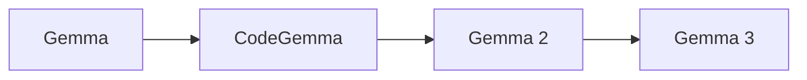

# Google Gemma Model Guide

Gemma is Google's family of lightweight open-weight models, built from research and technology developed for Gemini. The family emphasizes practical local deployment, transparent model cards, and multiple sizes.

## Evolution

## Comparison

| Model | Parameters | Context | Modality | Defining focus |
|---|---:|---:|---|---|
| [Gemma](gemma.md) | 2B, 7B | 8K | Text | First compact open family |
| [CodeGemma](codegemma.md) | 2B, 7B | 8K | Code + text | Code completion and instruction following |
| [Gemma 2](gemma-2.md) | 2B, 9B, 27B | 8K | Text | Distillation and improved efficiency |
| [Gemma 3](gemma-3.md) | 270M–27B | 32K–128K | Text; image on 4B+ | Multilingual vision-language family |

## Capability Matrix

| Model | Chat | Code | Reasoning | Tools/RAG | Multimodal | Local deployment |
|---|:---:|:---:|:---:|:---:|:---:|:---:|
| Gemma | ● | ◐ | ◐ | ◐ | — | ● |
| CodeGemma | ● | ● | ◐ | ◐ | — | ● |
| Gemma 2 | ● | ● | ◐ | ◐ | — | ● |
| Gemma 3 | ● | ● | ● | ◐ | ● | ● |

**Legend:** ● strong or defining · ◐ partial or variant-dependent · — not defining

## How to Choose

- Start with the smallest model that meets your quality and context requirements.
- Check the exact checkpoint: context, modality, license, and instruction format can differ within one generation.
- Measure quality, latency, memory, and safety on your own workload rather than relying on one benchmark.
- Ground factual applications with trusted data and validate generated code before execution.

## Official Sources

- [Official Gemma documentation](https://ai.google.dev/gemma/docs/core/model_card)
- [Official CodeGemma documentation](https://ai.google.dev/gemma/docs/codegemma)
- [Official Gemma 2 documentation](https://ai.google.dev/gemma/docs/core/model_card_2)
- [Official Gemma 3 documentation](https://ai.google.dev/gemma/docs/core/model_card_3)
