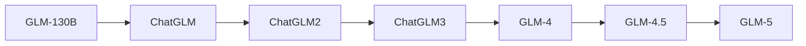

# Z.ai GLM Model Guide

GLM evolved from autoregressive blank infilling research into the ChatGLM bilingual assistant family and modern Z.ai reasoning, coding, multimodal, and agentic models.

## Evolution

## Comparison

| Model | Parameters | Context | Modality | Defining focus |
|---|---:|---:|---|---|
| [GLM-130B](glm-130b.md) | 130B | 2K | Text | Bilingual foundation model |
| [ChatGLM](chatglm.md) | 6B | 2K | Text | Compact bilingual dialogue |
| [ChatGLM2](chatglm2.md) | 6B | 32K | Text | Longer context and efficiency |
| [ChatGLM3](chatglm3.md) | 6B | 32K | Text + tools | Agent and function calling |
| [GLM-4](glm-4.md) | 9B open; hosted larger | 128K | Text + vision variants | Modern multilingual family |
| [GLM-4.5](glm-4.5.md) | 355B / 32B active | 128K | Text + tools | Open agentic MoE |
| [GLM-5](glm-5.md) | 744B / 40B active | 200K | Text + tools | Large reasoning and coding MoE |

## Capability Matrix

| Model | Chat | Code | Reasoning | Tools/agents | Multimodal | Open weights |
|---|:---:|:---:|:---:|:---:|:---:|:---:|
| GLM-130B | ● | ◐ | ◐ | ◐ | — | ● |
| ChatGLM | ● | ● | ◐ | ◐ | — | ● |
| ChatGLM2 | ● | ● | ◐ | ◐ | — | ● |
| ChatGLM3 | ● | ● | ◐ | ● | — | ● |
| GLM-4 | ● | ● | ◐ | ● | — | ● |
| GLM-4.5 | ● | ● | ● | ● | — | ● |
| GLM-5 | ● | ● | ● | ● | — | ● |

**Legend:** ● strong or defining · ◐ partial or variant-dependent · — not defining

## Reading Notes

- A family name can cover multiple checkpoints; always verify the exact model card.
- Compare active parameters, context, modalities, license, latency, and memory—not only benchmark scores.
- Tool access belongs partly to the hosting product, so it may not be present in downloadable weights.
- Ground important claims in trusted sources and test generated code before execution.

## Official Sources

- [GLM-130B documentation](https://github.com/THUDM/GLM-130B)
- [ChatGLM-6B documentation](https://github.com/THUDM/ChatGLM-6B)
- [ChatGLM2-6B documentation](https://github.com/THUDM/ChatGLM2-6B)
- [ChatGLM3-6B documentation](https://github.com/THUDM/ChatGLM3)
- [GLM-4 documentation](https://github.com/THUDM/GLM-4)
- [GLM-4.5 documentation](https://github.com/zai-org/GLM-4.5)
- [GLM-5 documentation](https://github.com/zai-org/GLM-5)
