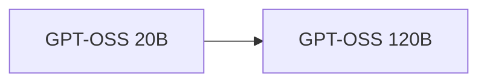

# OpenAI GPT-OSS Model Guide

GPT-OSS is OpenAI's open-weight reasoning-model family. It combines sparse mixture-of-experts computation, configurable reasoning effort, and agentic tool use in locally deployable models.

## Evolution

## Comparison

| Model | Parameters | Context | Modality | Defining focus |
|---|---:|---:|---|---|
| [GPT-OSS 20B](gpt-oss-20b.md) | 21B / 3.6B active | 131K | Text | Low-latency local reasoning |
| [GPT-OSS 120B](gpt-oss-120b.md) | 117B / 5.1B active | 131K | Text | Higher-capacity open reasoning |

## Capability Matrix

| Model | Chat | Code | Reasoning | Tools/RAG | Multimodal | Local deployment |
|---|:---:|:---:|:---:|:---:|:---:|:---:|
| GPT-OSS 20B | ● | ◐ | ◐ | ● | — | ● |
| GPT-OSS 120B | ● | ● | ● | ● | — | ● |

**Legend:** ● strong or defining · ◐ partial or variant-dependent · — not defining

## How to Choose

- Start with the smallest model that meets your quality and context requirements.
- Check the exact checkpoint: context, modality, license, and instruction format can differ within one generation.
- Measure quality, latency, memory, and safety on your own workload rather than relying on one benchmark.
- Ground factual applications with trusted data and validate generated code before execution.

## Official Sources

- [Official GPT-OSS 20B documentation](https://developers.openai.com/api/docs/models/gpt-oss-20b)
- [Official GPT-OSS 120B documentation](https://developers.openai.com/api/docs/models/gpt-oss-120b)
