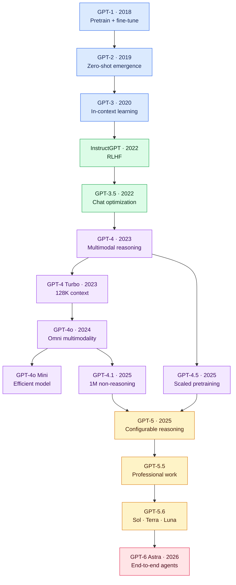

# GPT Model Guide

This directory explains the evolution of OpenAI's GPT family. Parameter counts are shown only when OpenAI published them.

## GPT Evolution

## Model Comparison

| Model | Released | Published size | Context | Defining change |
|---|---:|---:|---:|---|
| [GPT-1](gpt-1.md) | 2018 | 117M | 512 | Generative pretraining and fine-tuning |
| [GPT-2](gpt-2.md) | 2019 | 1.5B | 1K | Zero-shot task behavior |
| [GPT-3](gpt-3.md) | 2020 | 175B | 2K | In-context few-shot learning |
| [InstructGPT](instructgpt.md) | 2022 | 1.3B–175B experiments | 2K | RLHF and instruction following |
| [GPT-3.5](gpt-3.5.md) | 2022 | Not disclosed | Up to 16K | Accessible conversational AI |
| [GPT-4](gpt-4.md) | 2023 | Not disclosed | 8K / 32K | Stronger reasoning and vision |
| [GPT-4 Turbo](gpt-4-turbo.md) | 2023 | Not disclosed | 128K | Longer context and lower cost |
| [GPT-4o](gpt-4o.md) | 2024 | Not disclosed | 128K | Native omni multimodality |
| [GPT-4o Mini](gpt-4o-mini.md) | 2024 | Not disclosed | 128K | Affordable multimodal model |
| [GPT-4.1](gpt-4.1.md) | 2025 | Not disclosed | 1M | Coding and non-reasoning agents |
| [GPT-4.5](gpt-4.5.md) | 2025 | Not disclosed | 128K | Scaled unsupervised learning |
| [GPT-5](gpt-5.md) | 2025 | Not disclosed | 400K | Mainstream configurable reasoning |
| [GPT-5.5](gpt-5.5.md) | 2026 | Not disclosed | 400K | Coding and professional work |
| [GPT-5.6](gpt-5.6.md) | 2026 | Not disclosed | 1.05M | Sol, Terra, and Luna tiers |
| [GPT-6 Astra](gpt-6-astra.md) | 2026 | Not disclosed | 1.05M | Long-running end-to-end agents |

## Capability Matrix

| Generation | Chat | Vision | Reasoning control | Tools | Long context | Agents |
|---|:---:|:---:|:---:|:---:|:---:|:---:|
| GPT-1–3 | ◐ | — | — | — | — | — |
| InstructGPT / GPT-3.5 | ● | — | — | ◐ | — | — |
| GPT-4 / Turbo | ● | ● | — | ● | ◐ | ◐ |
| GPT-4o family | ● | ● | — | ● | ◐ | ● |
| GPT-4.1 / 4.5 | ● | ● | — | ● | ● | ● |
| GPT-5 family | ● | ● | ● | ● | ● | ● |
| GPT-6 Astra | ● | ● | ● | ● | ● | ● |

**Legend:** ● primary or strong capability · ◐ partial or emerging capability · — not a defining capability

For the combined long-form explanation of GPT-1 through GPT-3, see [GPT fundamentals](gpt.md).

## Official Sources

- [OpenAI model catalog](https://developers.openai.com/api/docs/models/all)
- [OpenAI model guidance](https://developers.openai.com/api/docs/guides/latest-model)
