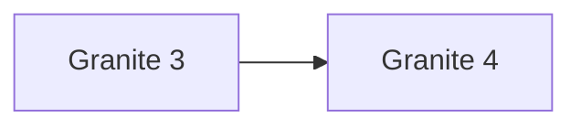

# IBM Granite Model Guide

Granite is IBM's open enterprise model family, emphasizing efficient deployment, RAG, tool use, governance, and transparent licensing.

## Evolution

## Comparison

| Model | Parameters | Context | Modality | Defining focus |
|---|---:|---:|---|---|
| [Granite 3](granite-3.md) | 1B–8B dense; 1B/3B active MoE | 128K | Text; specialist variants | Compact enterprise models |
| [Granite 4](granite-4.md) | 350M–32B total | 128K | Text | Hybrid Mamba-2/Transformer efficiency |

## Capability Matrix

| Model | Chat | Code | Reasoning | Tools/agents | Multimodal | Open weights |
|---|:---:|:---:|:---:|:---:|:---:|:---:|
| Granite 3 | ● | ◐ | ● | ◐ | — | ● |
| Granite 4 | ● | ● | ● | ● | — | ● |

**Legend:** ● strong or defining · ◐ partial or variant-dependent · — not defining

## Reading Notes

- A family name can cover multiple checkpoints; always verify the exact model card.
- Compare active parameters, context, modalities, license, latency, and memory—not only benchmark scores.
- Tool access belongs partly to the hosting product, so it may not be present in downloadable weights.
- Ground important claims in trusted sources and test generated code before execution.

## Official Sources

- [Granite 3 documentation](https://www.ibm.com/granite/docs/models/granite)
- [Granite 4 documentation](https://www.ibm.com/granite/docs/models/granite4-0)
