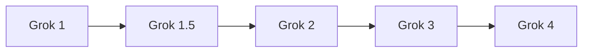

# xAI Grok Model Guide

Grok is xAI's model family for conversational assistance, reasoning, coding, multimodal understanding, and real-time information access through tools and X.

## Evolution

## Comparison

| Model | Parameters | Context | Modality | Defining focus |
|---|---:|---:|---|---|
| [Grok 1](grok-1.md) | 314B MoE | 8K | Text | First released architecture and open weights |
| [Grok 1.5](grok-1.5.md) | Undisclosed | 128K | Text | Long context and stronger reasoning |
| [Grok 2](grok-2.md) | Undisclosed | Variant-dependent | Text + image input | Improved chat, code, and vision |
| [Grok 3](grok-3.md) | Undisclosed | Variant-dependent | Text + tools | Reasoning models and DeepSearch |
| [Grok 4](grok-4.md) | Undisclosed | Up to 2M in Fast | Text + tools | Frontier reasoning and agents |

## Capability Matrix

| Model | Chat | Code | Reasoning | Tools/agents | Multimodal | Open weights |
|---|:---:|:---:|:---:|:---:|:---:|:---:|
| Grok 1 | ● | ◐ | ◐ | ◐ | — | ● |
| Grok 1.5 | ● | ● | ◐ | ◐ | — | — |
| Grok 2 | ● | ● | ◐ | ● | ● | — |
| Grok 3 | ● | ● | ● | ● | — | — |
| Grok 4 | ● | ● | ● | ● | — | — |

**Legend:** ● strong or defining · ◐ partial or variant-dependent · — not defining

## Reading Notes

- A family name can cover multiple checkpoints; always verify the exact model card.
- Compare active parameters, context, modalities, license, latency, and memory—not only benchmark scores.
- Tool access belongs partly to the hosting product, so it may not be present in downloadable weights.
- Ground important claims in trusted sources and test generated code before execution.

## Official Sources

- [Grok 1 documentation](https://github.com/xai-org/grok-1)
- [Grok 1.5 documentation](https://x.ai/news/grok-1.5)
- [Grok 2 documentation](https://x.ai/news/grok-2)
- [Grok 3 documentation](https://x.ai/news/grok-3)
- [Grok 4 documentation](https://x.ai/news/grok-4-fast)
