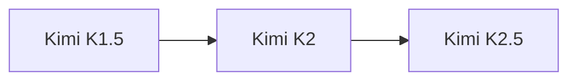

# Moonshot AI Kimi Model Guide

Kimi is Moonshot AI's family for long-context assistance, multimodal reasoning, coding, and agents. The K-series increasingly uses reinforcement learning and sparse expert architectures.

## Evolution

## Comparison

| Model | Parameters | Context | Modality | Defining focus |
|---|---:|---:|---|---|
| [Kimi K1.5](kimi-k1.5.md) | Undisclosed | 128K | Text + image | Multimodal long-context reasoning |
| [Kimi K2](kimi-k2.md) | 1T / 32B active | 128K–256K by release | Text | Agentic MoE and coding |
| [Kimi K2.5](kimi-k2.5.md) | 1T / 32B active | 256K | Text + image/video | Native multimodal agents |

## Capability Matrix

| Model | Chat | Code | Reasoning | Tools/agents | Multimodal | Open weights |
|---|:---:|:---:|:---:|:---:|:---:|:---:|
| Kimi K1.5 | ● | ◐ | ◐ | ◐ | ● | ● |
| Kimi K2 | ● | ● | ● | ● | — | ● |
| Kimi K2.5 | ● | ● | ● | ● | ● | ● |

**Legend:** ● strong or defining · ◐ partial or variant-dependent · — not defining

## Reading Notes

- A family name can cover multiple checkpoints; always verify the exact model card.
- Compare active parameters, context, modalities, license, latency, and memory—not only benchmark scores.
- Tool access belongs partly to the hosting product, so it may not be present in downloadable weights.
- Ground important claims in trusted sources and test generated code before execution.

## Official Sources

- [Kimi K1.5 documentation](https://github.com/MoonshotAI/Kimi-k1.5)
- [Kimi K2 documentation](https://github.com/MoonshotAI/Kimi-K2)
- [Kimi K2.5 documentation](https://github.com/MoonshotAI/Kimi-K2.5)
