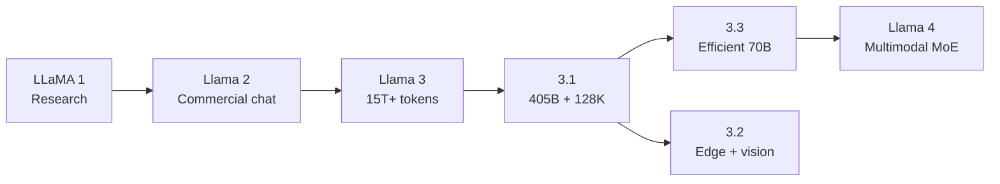

# Llama Model Guide

## Evolution

## Comparison

| Generation | Sizes | Context | Modality | Defining change |
|---|---|---:|---|---|
| [LLaMA 1](llama-1.md) | 7B–65B | 2K | Text | Efficient research foundation |
| [Llama 2](llama-2.md) | 7B–70B | 4K | Text | Official chat models and commercial use |
| [Llama 3](llama-3.md) | 8B, 70B | 8K | Text | 15T+ tokens and new tokenizer |
| [Llama 3.1](llama-3.1.md) | 8B, 70B, 405B | 128K | Text | Frontier-scale open model |
| [Llama 3.2](llama-3.2.md) | 1B, 3B, 11B, 90B | 128K | Text + image | Edge and vision variants |
| [Llama 3.3](llama-3.3.md) | 70B | 128K | Text | Stronger efficient multilingual model |
| [Llama 4](llama-4.md) | 109B, 400B total | 1M–10M | Text + image | Native multimodal MoE |

## Capability Matrix

| Family | Chat | Code | Vision | Tools | Long context | Local use |
|---|:---:|:---:|:---:|:---:|:---:|:---:|
| LLaMA 1 | — | ◐ | — | — | — | ● |
| Llama 2 | ● | ◐ | — | — | — | ● |
| Llama 3 / 3.1 | ● | ● | — | ● | ● | ● |
| Llama 3.2 | ● | ◐ | ● | ● | ● | ● |
| Llama 3.3 | ● | ● | — | ● | ● | ◐ |
| Llama 4 | ● | ● | ● | ● | ● | ◐ |

**Legend:** ● strong or defining · ◐ partial or variant-dependent · — not defining
