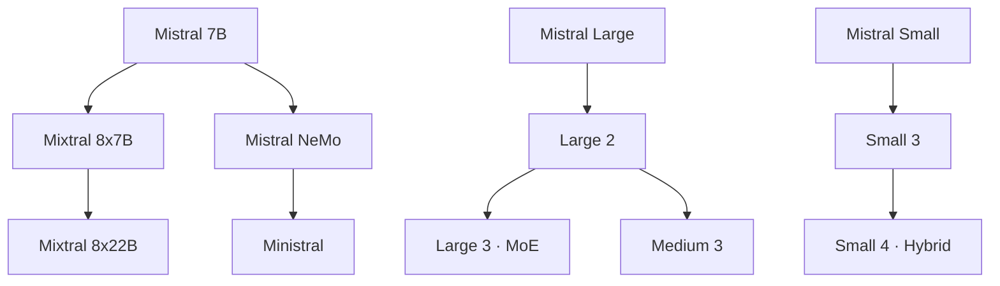

# Mistral Model Guide

## Evolution

## Comparison

| Model | Parameters | Context | Open weights | Main focus |
|---|---:|---:|:---:|---|
| [Mistral 7B](mistral-7b.md) | 7B dense | 8K | ● | Efficient foundation |
| [Mixtral 8x7B](mixtral-8x7b.md) | 46.7B / 12.9B active | 32K | ● | Sparse MoE |
| [Mixtral 8x22B](mixtral-8x22b.md) | 141B / 39B active | 64K | ● | Larger MoE |
| [Mistral NeMo](mistral-nemo.md) | 12B dense | 128K | ● | Multilingual deployment |
| [Mistral Large](mistral-large.md) | Not disclosed | 32K | — | Commercial flagship |
| [Mistral Large 2](mistral-large-2.md) | 123B dense | 128K | ◐ | Code and multilingual work |
| [Mistral Large 3](mistral-large-3.md) | 675B / 41B active | Long context | ● | Multimodal frontier MoE |
| [Mistral Small 3](mistral-small-3.md) | 24B dense | Up to 128K | ● | Low latency |
| [Mistral Small 4](mistral-small-4.md) | 119B / 6B active | 256K | ● | Reasoning + vision + agents |
| [Mistral Medium 3](mistral-medium-3.md) | Not disclosed | Long context | ◐ | Enterprise balance |
| [Ministral](ministral.md) | 3B–14B | Up to 128K | ● | Edge and local deployment |

## Capability Matrix

| Family | Chat | Code | Vision | Reasoning | Agents | Local use |
|---|:---:|:---:|:---:|:---:|:---:|:---:|
| Mistral / Mixtral | ● | ● | — | ◐ | ◐ | ● |
| NeMo / Ministral | ● | ● | ◐ | ◐ | ● | ● |
| Large 2 / Medium 3 | ● | ● | ● | ● | ● | ◐ |
| Large 3 / Small 4 | ● | ● | ● | ● | ● | ◐ |

**Legend:** ● strong or defining · ◐ partial, licensed, or variant-dependent · — not defining
