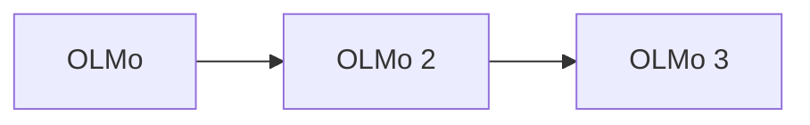

# Ai2 OLMo Model Guide

OLMo is Ai2's fully open language-model program: weights, training data, code, intermediate checkpoints, and evaluation artifacts are released to support reproducible research.

## Evolution

## Comparison

| Model | Parameters | Context | Modality | Defining focus |
|---|---:|---:|---|---|
| [OLMo](olmo.md) | 1B, 7B | 2K–4K | Text | End-to-end open training stack |
| [OLMo 2](olmo-2.md) | 7B, 13B, 32B | 4K | Text | Improved data and training stability |
| [OLMo 3](olmo-3.md) | 7B, 32B variants | Up to 65K | Text | Transparent reasoning and long context |

## Capability Matrix

| Model | Chat | Code | Reasoning | Tools/agents | Multimodal | Open weights |
|---|:---:|:---:|:---:|:---:|:---:|:---:|
| OLMo | ● | ◐ | ◐ | ◐ | — | ● |
| OLMo 2 | ● | ● | ● | ● | — | ● |
| OLMo 3 | ● | ● | ● | ● | — | ● |

**Legend:** ● strong or defining · ◐ partial or variant-dependent · — not defining

## Reading Notes

- A family name can cover multiple checkpoints; always verify the exact model card.
- Compare active parameters, context, modalities, license, latency, and memory—not only benchmark scores.
- Tool access belongs partly to the hosting product, so it may not be present in downloadable weights.
- Ground important claims in trusted sources and test generated code before execution.

## Official Sources

- [OLMo documentation](https://allenai.org/olmo)
- [OLMo 2 documentation](https://allenai.org/blog/olmo2)
- [OLMo 3 documentation](https://allenai.org/olmo)
