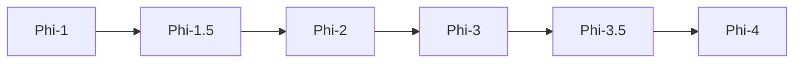

# Microsoft Phi Model Guide

Phi is Microsoft's small-language-model family. Its central idea is that carefully selected and synthetic training data can give compact models strong reasoning, coding, and language abilities.

## Evolution

## Comparison

| Model | Parameters | Context | Modality | Defining focus |
|---|---:|---:|---|---|
| [Phi-1](phi-1.md) | 1.3B | 2K | Text/code | Textbook-quality code data |
| [Phi-1.5](phi-1.5.md) | 1.3B | 2K | Text | Broader common-sense reasoning |
| [Phi-2](phi-2.md) | 2.7B | 2K | Text | Scaled curated training |
| [Phi-3](phi-3.md) | 3.8B–14B | 4K–128K | Text; vision variant | Production-oriented SLM family |
| [Phi-3.5](phi-3.5.md) | 3.8B / MoE / vision | Up to 128K | Text + vision variants | Multilingual and multimodal expansion |
| [Phi-4](phi-4.md) | 3.8B–14B+ variants | Up to 128K | Text, vision, audio variants | Reasoning and multimodality |

## Capability Matrix

| Model | Chat | Code | Reasoning | Tools/RAG | Multimodal | Local deployment |
|---|:---:|:---:|:---:|:---:|:---:|:---:|
| Phi-1 | ● | ◐ | ◐ | ◐ | — | ● |
| Phi-1.5 | ● | ● | ◐ | ◐ | — | ● |
| Phi-2 | ● | ● | ◐ | ◐ | — | ● |
| Phi-3 | ● | ● | ◐ | ◐ | — | ● |
| Phi-3.5 | ● | ● | ◐ | ◐ | ● | ● |
| Phi-4 | ● | ● | ● | ◐ | ● | ● |

**Legend:** ● strong or defining · ◐ partial or variant-dependent · — not defining

## How to Choose

- Start with the smallest model that meets your quality and context requirements.
- Check the exact checkpoint: context, modality, license, and instruction format can differ within one generation.
- Measure quality, latency, memory, and safety on your own workload rather than relying on one benchmark.
- Ground factual applications with trusted data and validate generated code before execution.

## Official Sources

- [Official Phi-1 documentation](https://www.microsoft.com/en-us/research/publication/textbooks-are-all-you-need/)
- [Official Phi-1.5 documentation](https://www.microsoft.com/en-us/research/publication/textbooks-are-all-you-need-ii-phi-1-5-technical-report/)
- [Official Phi-2 documentation](https://www.microsoft.com/en-us/research/blog/phi-2-the-surprising-power-of-small-language-models/)
- [Official Phi-3 documentation](https://azure.microsoft.com/en-us/blog/introducing-phi-3-redefining-whats-possible-with-slms/)
- [Official Phi-3.5 documentation](https://huggingface.co/collections/microsoft/phi-35-669e5fab625884a6e089859b)
- [Official Phi-4 documentation](https://huggingface.co/collections/microsoft/phi-4-677e9380e514feb5577a40e4)
