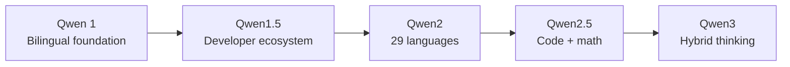

# Qwen Model Guide

## Evolution

## Comparison

| Generation | Main sizes | Context | Architecture | Defining change |
|---|---|---:|---|---|
| [Qwen 1](qwen-1.md) | 1.8B–72B | Up to 32K | Dense | Chinese-English base and chat |
| [Qwen1.5](qwen1.5.md) | 0.5B–110B | 32K | Dense + MoE | Easier deployment and alignment |
| [Qwen2](qwen2.md) | 0.5B–72B | Up to 128K | Dense + 57B-A14B MoE | More languages, code, and math |
| [Qwen2.5](qwen2.5.md) | 0.5B–72B | Up to 128K | Dense | Structured output and specialists |
| [Qwen3](qwen3.md) | 0.6B–235B total | 32K–256K; extendable to 1M | Dense + MoE | Thinking/non-thinking in one family |

## Capability Matrix

| Generation | Chat | Code | Math | Tools | Multilingual | Reasoning mode |
|---|:---:|:---:|:---:|:---:|:---:|:---:|
| Qwen 1 | ● | ● | ◐ | ● | ◐ | — |
| Qwen1.5 | ● | ● | ● | ● | ● | — |
| Qwen2 | ● | ● | ● | ● | ● | ◐ |
| Qwen2.5 | ● | ● | ● | ● | ● | ◐ |
| Qwen3 | ● | ● | ● | ● | ● | ● |

**Legend:** ● strong or defining · ◐ partial or variant-dependent · — not defining

## Official Sources
- [Qwen blog](https://qwenlm.github.io/blog/)
- [Qwen repositories](https://github.com/QwenLM)
