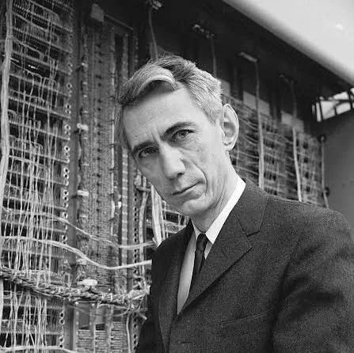

# Claude Shannon

## Early Statistical Language Modeling

<p align="center">
  
</p>

<p align="center">
  <strong>Claude Shannon</strong>
</p>

In 1948, Claude Shannon explored how language could be treated as a probabilistic process. His work showed that the probability of the next character can depend on the characters that came before it.

For example, imagine predicting the next character after `TH`:

```text id="4t6ezg"
Type:

TH_

What comes next?

E ███████████████  61%
A ███               12%
I ██                 8%
O █                  5%
...
```

> **Note:** The probabilities above are illustrative examples, not Shannon's original measurements.

The basic idea is:

```text id="k1k1e1"
Previous characters
        ↓
Probability
        ↓
Next character
```

This idea became one of the foundations for statistical approaches to language modeling.